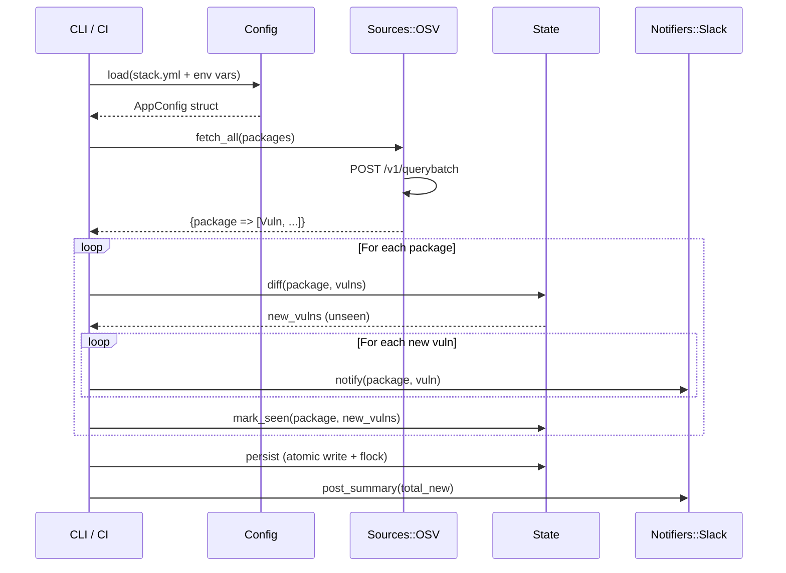
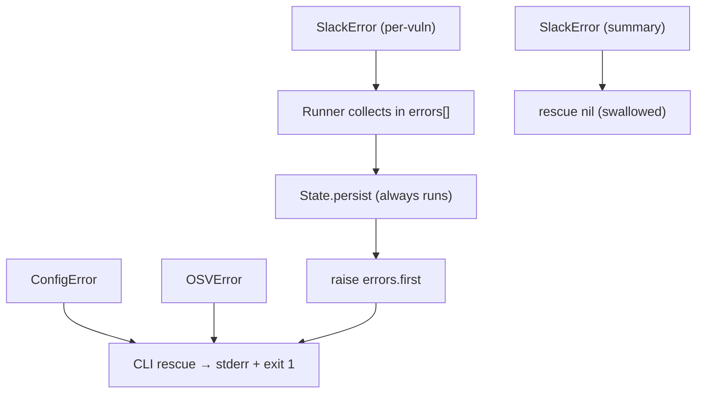

# StackWatch Architecture — Zero to Hero

This document takes you from knowing nothing about StackWatch to understanding every design decision, data flow, and implementation detail as if you built it yourself.

---

## 1. What is StackWatch

StackWatch is a self-hosted CVE monitoring tool for your entire technology stack. Dependabot and similar tools cover your repository's direct dependencies — StackWatch covers everything else: your editor, your OS packages, your database, your identity provider, your terminal tools, your infrastructure software.

You declare the packages you care about in a YAML file, StackWatch queries the OSV (Open Source Vulnerabilities) database for known vulnerabilities, compares results against previously seen CVEs, and posts new findings to your Slack channel. It runs once and exits — scheduling is external (cron, GitHub Actions, CI pipelines).

---

## 2. High-level Data Flow



The entire lifecycle is a single-pass pipeline:

```
stack.yml → Config.load → OSV.fetch_all → State.diff → Slack.notify → State.persist
```

---

## 3. Project Layout

```
osvdev/
├── exe/
│   └── stackwatch              # Gem executable entry point
├── lib/
│   ├── stackwatch.rb           # Root module: version, errors, autoloads
│   └── stackwatch/
│       ├── cli.rb              # Thor CLI (run, init commands)
│       ├── config.rb           # YAML parsing, env resolution, validation
│       ├── runner.rb           # Orchestrator: fetch → diff → notify → persist
│       ├── state.rb            # JSON state file: load, diff, mark_seen, persist
│       ├── vuln.rb             # Vuln struct + OSV response normalization
│       ├── sources/
│       │   └── osv.rb          # HTTP client for api.osv.dev/v1/querybatch
│       └── notifiers/
│           └── slack.rb        # Slack incoming webhook poster
├── test/
│   ├── test_helper.rb          # Load paths, minitest setup, WebMock, helpers
│   ├── test_cli.rb             # CLI command tests
│   ├── test_config.rb          # Config parsing + validation tests
│   ├── test_runner.rb          # Runner integration tests with fakes
│   ├── test_state.rb           # State diff/persist/corruption tests
│   ├── test_vuln.rb            # OSV→Vuln mapping edge cases
│   ├── sources/
│   │   └── test_osv.rb         # OSV client + WebMock stubs
│   ├── notifiers/
│   │   └── test_slack.rb       # Slack notifier + WebMock stubs
│   └── fixtures/
│       ├── osv_querybatch_response.json
│       └── state_v1.json
├── examples/
│   ├── stack.yml               # Sample configuration
│   ├── github-actions.yml      # Copy-paste workflow
│   └── crontab                 # Docker + cron snippet
├── adapters/
│   └── github-action/
│       └── action.yml          # Composite GitHub Action (Docker-based)
├── .github/
│   └── workflows/
│       └── self-monitor.yml    # This repo's own CVE monitoring
├── Gemfile                     # Runtime + dev dependencies
├── Gemfile.lock                # Pinned dependency versions (committed)
├── Dockerfile                  # Multi-stage Alpine build
├── README.md                   # User-facing docs
├── USAGE.md                    # Extended usage guide
├── LICENSE                     # MIT
└── .gitignore
```

---

## 4. Module-by-Module Breakdown

### 4.1 `lib/stackwatch.rb` — Root Module

**Responsibility:** Define the module namespace, version constant, error classes, and autoload map.

**Public API:**
- `StackWatch::VERSION` — `"0.1.0"`
- `StackWatch::ConfigError` — raised for any config validation failure
- `StackWatch::Sources::OSVError` — raised for API failures
- `StackWatch::Notifiers::SlackError` — raised for webhook failures

**Design decisions:**
- Uses `autoload` instead of eager `require` — modules are loaded on first reference, keeping startup fast for the CLI.
- Error classes are defined in the root file so they're available before any submodule loads.
- stdlib dependencies (`json`, `net/http`, `psych`, `set`, `time`) are required here so all submodules can rely on them.

---

### 4.2 `lib/stackwatch/cli.rb` — CLI Entry

**Responsibility:** Parse command-line arguments and dispatch to the appropriate action.

**Public API:**
- `stackwatch run [--config] [--state-path]` — mapped to `#scan`
- `stackwatch init [--force]` — generates starter `stack.yml`

**Design decisions:**
- Built on Thor for minimal boilerplate and automatic `--help` generation.
- `exit_on_failure?` returns `true` so Thor exits with code 1 on argument errors.
- `map ["run"] => :scan` — the `run` command is internally named `scan` because `run` is a reserved method in some contexts.
- Error handling is centralized here: `ConfigError`/`OSVError` → stderr + exit 1, `SlackError` → labeled stderr + exit 1.
- The `STARTER_TEMPLATE` is a heredoc constant, not a file, to avoid packaging/path issues.

**Connections:** Instantiates `Config.load`, then calls `Runner.call`.

---

### 4.3 `lib/stackwatch/config.rb` — Configuration

**Responsibility:** Load and validate `stack.yml`, resolve environment variable overrides, return a frozen `AppConfig` struct.

**Public API:**
- `Config.load(path:, state_path_override:, env:)` → `AppConfig`
- `Package#validate!` — raises `ConfigError` on invalid entries
- `Package#critical?` — tier check

**Design decisions:**
- `Psych.safe_load_file` — prevents YAML deserialization attacks (no arbitrary Ruby objects).
- Webhook URL validation at parse time — detects unresolved `${...}` variables and invalid URIs immediately, before the run proceeds.
- Precedence chain for each setting: CLI flag > environment variable > YAML value > hardcoded default.
- `env:` parameter is injectable (defaults to `ENV`) for testability without polluting the real environment.
- Returns nil for `slack_webhook_url` when Slack is not configured — Runner uses this to skip notification entirely.

**Connections:** Produces `AppConfig` consumed by `Runner`. `Package` structs flow through the entire pipeline.

---

### 4.4 `lib/stackwatch/runner.rb` — Orchestrator

**Responsibility:** Wire together source, state, and notifier into a single scan cycle.

**Public API:**
- `Runner.call(config, stdout:, stderr:, source:, notifier:)` → `Integer` (count of new vulns)

**Design decisions:**
- Class method `.call` with constructor injection — allows tests to swap in fakes for source/notifier without touching real HTTP.
- Partial-failure resilience: individual `SlackError`s are caught per-vuln, collected, and re-raised after state is safely persisted. This prevents duplicate notifications on retry.
- `mark_seen` is called per-package inside the loop, `persist` once at the end — balances write frequency with atomicity.
- `post_summary` is wrapped in `rescue nil` — if the summary fails, we don't lose the entire run's state.
- stdout/stderr are injectable for test capture.

**Connections:** Depends on `State`, `Sources::OSV` (or any source), `Notifiers::Slack` (or any notifier).

---

### 4.5 `lib/stackwatch/state.rb` — State Persistence

**Responsibility:** Track which CVE IDs have been seen per package, persist to JSON, handle corruption gracefully.

**Public API:**
- `State.load(path)` → `State`
- `#diff(package, vulns)` → `[Vuln]` (unseen only)
- `#mark_seen(package, vulns)` — record IDs in memory
- `#persist` — atomic write to disk with file lock

**Design decisions:**
- Atomic write: write to `#{path}.tmp.#{pid}`, then `File.rename` — rename is atomic on POSIX filesystems, preventing half-written state files.
- File locking: `flock(LOCK_EX)` on a `.lock` sibling file — prevents concurrent runs from corrupting state (e.g., manual trigger overlapping a scheduled run).
- Cap at 500 IDs per package (`MAX_SEEN_PER_PACKAGE`) — prevents unbounded growth. Old CVEs that rotate out are no longer returned by OSV anyway.
- Corruption recovery: if `state.json` is invalid JSON, logs a warning and starts fresh rather than crashing.
- Migration: `#migrate` ensures required keys exist, allowing forward-compatible schema changes keyed on `version`.
- `Set`-based lookup in `#diff` — O(1) per ID regardless of state size.

**Connections:** Loaded by `Runner`, receives `Package` structs from Config.

---

### 4.6 `lib/stackwatch/vuln.rb` — Vulnerability Model

**Responsibility:** Normalize raw OSV API response hashes into a consistent `Vuln` struct.

**Public API:**
- `Vuln.from_osv(raw_hash)` → `Vuln`
- Struct fields: `id`, `summary`, `cvss_score`, `affected`, `fixed`, `url`

**Design decisions:**
- `Struct` with `keyword_init: true` — lightweight, immutable-ish value object. No need for a full class.
- Factory method `from_osv` on `class << self` — keeps OSV-specific parsing logic co-located with the struct.
- Defensive extraction: every field has a fallback chain (e.g., summary falls back to first 200 chars of details, CVSS falls back to `database_specific`, then to `"N/A"`).
- URL is constructed, not extracted — `https://osv.dev/vulnerability/#{id}` is deterministic.
- Only parses the first affected range — sufficient for alert messaging; full version analysis is out of scope.

**Connections:** Created by `Sources::OSV.parse_response`, consumed by `Notifiers::Slack` and `State`.

---

### 4.7 `lib/stackwatch/sources/osv.rb` — OSV API Client

**Responsibility:** Query the OSV querybatch endpoint for all configured packages in a single HTTP round-trip.

**Public API:**
- `OSV.new(packages)` → `OSV`
- `#fetch_all` → `{Package => [Vuln]}`

**Design decisions:**
- Single HTTP call via `/v1/querybatch` — queries all packages at once rather than N individual requests. The response array maintains positional correspondence with the query array.
- 15-second timeout — generous for a batch query; prevents infinite hangs.
- Error wrapping: `Net::HTTP` exceptions and JSON parse errors are re-raised as `OSVError` with context, keeping the error hierarchy clean.
- No retry logic — the tool runs on a schedule, so a transient failure is retried on next invocation.
- `@packages.zip(results)` — pairs each package with its corresponding result slot by index.

**Connections:** Returns `Vuln` structs (via `Vuln.from_osv`). Invoked by `Runner`.

---

### 4.8 `lib/stackwatch/notifiers/slack.rb` — Slack Notifier

**Responsibility:** POST vulnerability alerts and summaries to a Slack incoming webhook.

**Public API:**
- `Slack.new(webhook_url)` → `Slack`
- `#notify(package:, vuln:)` — posts a single alert
- `#post_summary(total_new)` — posts the run summary

**Design decisions:**
- `<!here>` mention only for `critical` tier packages — avoids notification fatigue for standard-tier findings.
- 10-second timeout — faster fail than OSV since webhooks should respond quickly.
- Error wrapping: HTTP failures become `SlackError`.
- Message format uses Slack mrkdwn: bold, links, emoji — renders well in Slack without requiring Block Kit complexity.
- `URI` is parsed once in the constructor — validates URL format eagerly.

**Connections:** Invoked by `Runner` per-vuln and per-run.

---

## 5. Domain Model

### Package

| Field | Type | Description |
|-------|------|-------------|
| `name` | String | Package name as registered in the ecosystem (e.g., `"django"`, `"next"`) |
| `ecosystem` | String | OSV ecosystem identifier (e.g., `"PyPI"`, `"npm"`, `"RubyGems"`, `"Debian"`) |
| `tier` | String | Alert severity: `"critical"` (triggers @here) or `"standard"` (silent post) |

### AppConfig

| Field | Type | Description |
|-------|------|-------------|
| `packages` | `[Package]` | List of packages to monitor |
| `slack_webhook_url` | String or nil | Slack webhook URL; nil means no notifications |
| `state_path` | String | File path for state persistence |

### Vuln

| Field | Type | Description |
|-------|------|-------------|
| `id` | String | CVE/GHSA/PYSEC identifier (e.g., `"CVE-2024-27351"`) |
| `summary` | String | One-line description of the vulnerability |
| `cvss_score` | String | CVSS v3 score or `"N/A"` |
| `affected` | String | Affected version range (e.g., `">=3.2.0"`) or `"unknown"` |
| `fixed` | String or nil | Fixed version (e.g., `"3.2.25"`) or nil if no patch exists |
| `url` | String | Link to osv.dev vulnerability page |

### State file schema (`state.json`)

```json
{
  "version": 1,
  "updated_at": "2026-05-07T09:00:00Z",
  "packages": {
    "PyPI/django": ["CVE-2024-27351", "CVE-2024-99999"],
    "npm/next": ["GHSA-xxxx-yyyy-zzzz"]
  }
}
```

- `version` — schema version for future migrations
- `updated_at` — ISO 8601 timestamp of last persist
- `packages` — map of `"ecosystem/name"` → sorted array of seen CVE IDs (capped at 500 per package)

---

## 6. Configuration Resolution

Each setting follows a strict precedence chain (highest wins):

### Slack webhook URL

1. `STACKWATCH_SLACK_WEBHOOK` environment variable
2. `notifications.slack.webhook_url` in `stack.yml`
3. *(nil — Slack disabled)*

### State path

1. `--state-path` CLI flag
2. `STACKWATCH_STATE_PATH` environment variable
3. `state_path` key in `stack.yml`
4. `"state.json"` (hardcoded default)

### Validation rules

- The YAML file must exist and be a valid YAML mapping.
- `packages` must be an array of mappings, each with `name` and `ecosystem`.
- `tier` must be `"critical"` or `"standard"` (defaults to `"standard"` if omitted).
- If a webhook URL is resolved, it must not contain unresolved `${...}` variables and must parse as a valid URI.
- If no webhook URL is configured (no env var, no YAML key), Slack is simply disabled — no error. The tool still runs and prints findings to stdout.

---

## 7. State Management

### Lifecycle

```mermaid
flowchart LR
    Load["State.load(path)"] --> Read["read JSON"]
    Read --> Migrate["migrate schema"]
    Migrate --> Diff["diff(pkg, vulns)"]
    Diff --> MarkSeen["mark_seen(pkg, vulns)"]
    MarkSeen --> Persist["persist()"]
    Persist --> Lock["flock(LOCK_EX)"]
    Lock --> TmpWrite["write .tmp.PID"]
    TmpWrite --> Rename["rename → state.json"]
```



### Atomic persistence

1. Acquire exclusive lock on `state.json.lock`
2. Write state to `state.json.tmp.<pid>` (PID prevents collisions if locking fails)
3. `File.rename(tmp, state.json)` — atomic on POSIX
4. Lock released when block exits

This guarantees that `state.json` is never half-written. Readers always see either the old complete state or the new complete state.

### File locking

An exclusive `flock` on a sibling `.lock` file prevents two concurrent processes from both reading old state, both notifying, and then one overwriting the other's writes. The lock file is separate from the state file so that readers don't block on a shared lock during writes.

### Cap / pruning

Each package's seen-ID list is capped at `MAX_SEEN_PER_PACKAGE = 500`. When the cap is exceeded, the oldest entries are dropped (`.last(500)` keeps the most recently appended). This prevents unbounded file growth over months of operation. IDs that age out will not re-alert because OSV's querybatch only returns currently-active vulnerabilities.

### Corruption recovery

If `state.json` contains invalid JSON (e.g., disk corruption, interrupted write before atomic rename was adopted), `State#read` logs a warning to stderr and starts with an empty state. The first subsequent run will re-discover all active CVEs — noisy but safe.

### Migration strategy

The `#migrate` method ensures required keys (`version`, `packages`) exist. Future schema changes can key on the `version` field to transform old state files in place. Currently there is only version 1.

---

## 8. Error Handling Strategy

### Error classes

| Class | Raised by | Meaning |
|-------|-----------|---------|
| `ConfigError` | `Config`, `Package#validate!` | Invalid configuration — cannot proceed |
| `Sources::OSVError` | `Sources::OSV` | API failure (HTTP error, timeout, bad JSON) |
| `Notifiers::SlackError` | `Notifiers::Slack` | Webhook failure (HTTP error, timeout) |

### Error flow through the system



### Key guarantee

**State is always persisted before any error propagates.** This means:
- If OSV fails → no vulns fetched, no state change needed, error propagates immediately.
- If Slack fails for one vuln → error collected, remaining vulns still processed, state persisted, then error re-raised.
- If Slack fails for summary → swallowed (state already saved, per-vuln errors already collected).

### CLI exit codes

- `0` — success (zero or more new vulnerabilities found and reported)
- `1` — any error (config, API, or notification failure)

---

## 9. Testing Approach

### Test stack

- **Minitest** with `minitest-reporters` (SpecReporter for readable output)
- **WebMock** — disables all real HTTP; stubs OSV and Slack endpoints
- No mocking framework — uses hand-rolled fakes and `define_singleton_method` for one-off behavior overrides

### Test helper patterns

```ruby
stub_vuln(id:, summary:, ...)   # Creates a Vuln struct with sensible defaults
fixture("filename")              # Reads test/fixtures/<filename> as string
fixture_path("filename")         # Returns absolute path to fixture file
```

### Dependency injection in Runner

`Runner.call` accepts optional `source:` and `notifier:` parameters. Tests inject:
- `FakeSource` — returns canned results from `fetch_all`
- `FakeNotifier` — records calls to `notifications` and `summaries` arrays
- `FailingNotifier` — raises `SlackError` on every call

This eliminates all HTTP from Runner tests while exercising the full orchestration logic.

### Isolation

- Every test that touches the filesystem uses `Dir.mktmpdir` in `setup` and `FileUtils.rm_rf` in `teardown`.
- `Config` tests pass a custom `env:` hash instead of reading real environment variables.
- `stdout` and `stderr` are `StringIO` instances in Runner tests.

### Test coverage areas

| Test file | What it covers |
|-----------|---------------|
| `test_config.rb` | YAML parsing, env precedence, validation errors, missing fields, webhook validation |
| `test_runner.rb` | New vuln notification, skip seen, state persistence, partial failure, no-notifier mode |
| `test_state.rb` | Load/diff/mark_seen, atomic persist, corruption recovery, cap enforcement, lockfile |
| `test_vuln.rb` | OSV response normalization: happy path, missing fields, fallbacks |
| `sources/test_osv.rb` | HTTP stubbing, error handling, response parsing |
| `notifiers/test_slack.rb` | Payload format, @here logic, HTTP errors |
| `test_cli.rb` | `init` command, `run` error paths |

---

## 10. Deployment Models

### GitHub Actions (recommended)

```
Trigger: cron schedule or workflow_dispatch
State persistence: actions/cache (keyed by run_id, with restore-keys fallback)
Secrets: STACKWATCH_SLACK_WEBHOOK as repo secret
```

The workflow checks out the repo, restores cached `state.json`, runs StackWatch, and saves the updated state. The `if: always()` on the cache save step ensures state is persisted even if the run itself fails (errors are re-raised after state persist).

### Docker + cron

```
Image: ruby:3.3-alpine (multi-stage, ~30MB)
State persistence: mounted volume at /data/state.json
Scheduling: host crontab or systemd timer
```

The Dockerfile sets `STACKWATCH_STATE_PATH=/data/state.json` and declares `/data` as a volume. The entrypoint is `bin/stackwatch` with default `CMD ["run"]`.

### Local dev (cloned repo)

```bash
git clone https://github.com/yourorg/stackwatch.git
cd stackwatch
bundle install
bin/stackwatch init       # creates stack.yml
bin/stackwatch run        # runs once, state.json in cwd
```

State persists as a local file. No external scheduler — run manually or via `watch`/`crontab`.

### GitHub Action (composite, Docker-based)

The `adapters/github-action/action.yml` wraps the Docker image as a reusable action with typed inputs (`config`, `state-path`, `slack-webhook-url`). Users reference it as `uses: yourorg/stackwatch@v1`.

---

## 11. Extension Points

### Adding a new source

Create a class that responds to `fetch_all` returning `{Package => [Vuln]}`:

```ruby
module StackWatch
  module Sources
    class GitHubAdvisory
      def initialize(packages)
        @packages = packages
      end

      def fetch_all
        # Query GitHub Advisory Database
        # Return: { package => [Vuln.new(...), ...] }
      end
    end
  end
end
```

Wire it into `Runner` by passing `source: Sources::GitHubAdvisory.new(config.packages)`.

### Adding a new notifier

Create a class that responds to `notify(package:, vuln:)` and `post_summary(total_new)`:

```ruby
module StackWatch
  module Notifiers
    class Discord
      def initialize(webhook_url)
        @uri = URI(webhook_url)
      end

      def notify(package:, vuln:)
        # POST to Discord webhook
      end

      def post_summary(total_new)
        # POST summary message
      end
    end
  end
end
```

### Adding a new tier

1. Add the tier name to `Package::VALID_TIERS` in `config.rb`.
2. Add a predicate method (e.g., `def silent?; tier == "silent"; end`).
3. Update `Notifiers::Slack#format_message` to handle the new tier's mention behavior.

### Adding a new config setting

1. Add the field to `AppConfig` struct.
2. Add resolution logic in `Config#parse` (following the precedence pattern).
3. Consume it in `Runner` or the relevant module.

---

## 12. Known Constraints and Future Work

### Current constraints

- **No retry logic** — a single API timeout or 5xx fails the run. Acceptable because the tool runs on a schedule, but a 1-retry with exponential backoff would improve reliability.
- **No version pinning in queries** — OSV is queried by package name + ecosystem only, not by installed version. This means StackWatch reports all CVEs for a package, not just those affecting your specific version. This is by design (monitoring your stack's exposure surface), but could be refined.
- **Single querybatch call** — OSV's querybatch has an undocumented limit on query count. For very large package lists (100+), the response may be truncated. Chunking would address this.
- **Slack-only notifications** — v1 only ships the Slack notifier. The architecture supports pluggable notifiers, but Discord, email, and generic webhook adapters are not yet implemented.
- **No deduplication across ecosystems** — the same underlying vulnerability may have different IDs in different ecosystems (e.g., CVE vs GHSA vs PYSEC). Each is treated independently.

### Planned for future versions

- Discord and generic webhook notifiers (v1.1)
- RSS/GitHub Advisory Database as alternative sources (v1.1)
- Version-aware queries (filter by installed version)
- Configurable retry with backoff
- Batch chunking for large package lists
- Web dashboard for historical vulnerability timeline
